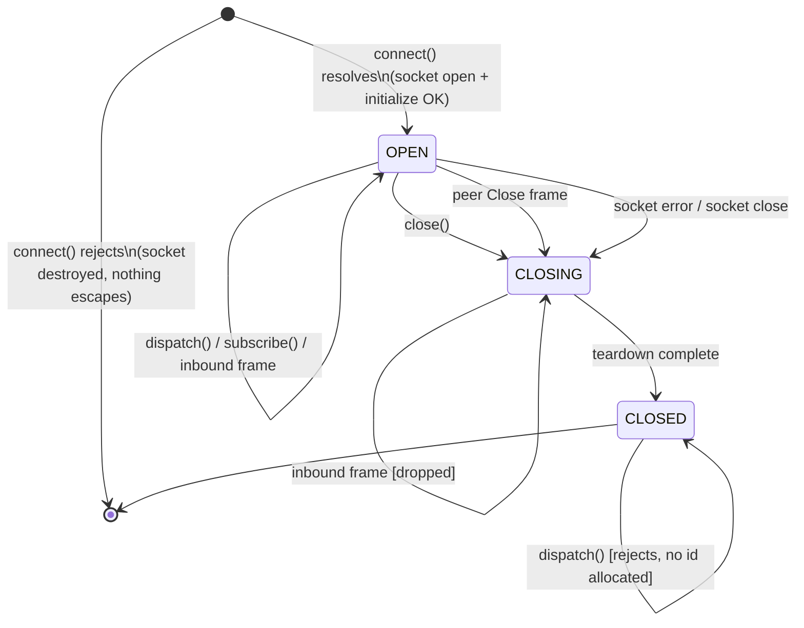

# #748 TypeScript Cluster Client — Ownership Design

**Status:** Proposed. This document is the Decision-5 gate. No `src/cluster/**` code may be written until it is reviewed and accepted.
**Scope:** `@the-open-engine/zeroshot/cluster` — the TypeScript binding of Cluster Protocol v1, mirroring `crates/openengine-cluster-client`.
**Baseline:** repo at `50c5b00`, branch `tomdps/bonito`. Rust client = 1,517 LOC across 11 files.
**Supersedes:** PRs #799, #800, #801, #802 (all closed unmerged 2026-07-25).

---

## 0. Executive summary

Four attempts produced 18,472 added lines and zero merged code. Eleven distinct defects were recorded. **Five of the eleven live in a full-socket-reconnect layer that has no counterpart anywhere in the Rust client** — code the parity contract never asked for. Three more are direct consequences of TypeScript lacking the two Rust language features that make the Rust client correct by construction: `&mut self` on `Receiver::next` (single-consumer enforcement) and by-value `self` on `reconnect` (linear consumption).

This design therefore makes four structural commitments:

1. **The connection is the sole allocator of request ids, and no public API accepts an id.** Collisions are impossible because there is no surface through which a caller can supply one.
2. **The subscription queue is a bounded FIFO with multiple waiters**, mirroring Rust's capacity of 1024 and its exact overflow semantics, but replacing Rust's compile-time single-consumer guarantee with a runtime FIFO waiter list.
3. **A `Connection` is constructed OPEN and never re-opens.** Its state machine is a three-node DAG. Reconnect constructs a _new_ connection; it never mutates an old one. Close-vs-reconnect races cannot interleave because the two operate on disjoint memory.
4. **`close()` never rejects.** Best-effort cancellation is reported after mandatory local teardown, never in place of it.

And one process commitment: **the repo's merge gate is currently blind to review findings.** PRs #800, #801 and #802 all had `check: pass`, and all four had `Greptile Review: pass`, while review filed nine P1s and one security P2. A merge queue on `--auto` would have merged #801 with four open P1s. §9 specifies the gate that must exist before attempt five opens.

---

## 1. Forensics

### 1.1 The four attempts

| PR   | Diff        | Opened     | Closed | Repo `check` | Review check | Findings filed          |
| ---- | ----------- | ---------- | ------ | ------------ | ------------ | ----------------------- |
| #799 | +4008 / −6  | 2026-07-25 | 05:06Z | **fail**     | pass         | 2 × P1                  |
| #800 | +5424 / −17 | 2026-07-25 | 06:27Z | pass         | pass         | 1 × P1, 1 × P2-security |
| #801 | +4384 / −4  | 2026-07-25 | 08:19Z | pass         | pass         | 4 × P1                  |
| #802 | +4656 / −4  | 2026-07-25 | 09:03Z | pass         | pass         | 2 × P1                  |

All four carried the identical title and the body `Closes #748`. All four targeted `dev`. The whole campaign ran in under four hours.

### 1.2 Recorded defects, classified

| ID      | PR  | Sev               | Defect (as recorded)                                                                                                                                                                                           | Class                | Root cause                            |
| ------- | --- | ----------------- | -------------------------------------------------------------------------------------------------------------------------------------------------------------------------------------------------------------- | -------------------- | ------------------------------------- |
| **D0**  | 799 | CI fail           | `src/cluster/json-guards.ts` named `src/agent-cli-provider/json.ts` **in a comment**; `check:agent-cli-provider:ci` string-matches source _and_ emitted CJS/ESM/`.d.ts`                                        | Isolation            | Package not self-contained            |
| **D1**  | 799 | P1                | `ClusterClient` allocated unary ids from a per-client `nextId` while `MultiplexedTransport` owned one shared pending map → two clients on one transport collide; second valid call rejected as already-pending | Id ownership         | Two allocators, one namespace         |
| **D2**  | 799 | P1                | `reconnect(freshClient)` fetched the snapshot through the fresh client but called `establishWatch(this.transport, …)` on the **original closed** transport                                                     | Transport lifetime   | Cold-start and resume paths conflated |
| **D3**  | 800 | P1                | Deferred registered in the connection-wide pending map **before** `writeFrame()`; a synchronous throw on a closed socket leaves the entry forever                                                              | Pending disposition  | No failure-path removal               |
| **D4**  | 800 | P2 + **security** | Subscription `AsyncQueue` unbounded; peer-controlled notifications accumulate without limit; buffered deliveries retained after `close()`                                                                      | Queue lifetime       | No capacity, no overflow path         |
| **D5**  | 801 | P1                | Fresh socket connects, then `get()` or `watchWithDedup()` rejects → fresh transport and any partially-established subscription leaked                                                                          | Transport lifetime   | Half-constructed object escapes       |
| **D6**  | 801 | P1                | `close()` completes while reconnect awaits connect/`get`/watch-establish; reconnect then **unconditionally installs** the fresh transport into the closed client                                               | Close/reconnect race | Mutable transport field               |
| **D7**  | 801 | P1                | Two `next()` calls after queue end each start `reconnectFullSocket()`; the later assignment overwrites the earlier transport, orphaning the first socket + subscription                                        | Close/reconnect race | Reconnect reachable from `next()`     |
| **D8**  | 801 | P1                | Queue stores **one** pending receiver; a second `recv()` overwrites `resolveWaiting`; the first consumer pends forever                                                                                         | Queue waiters        | Single-slot waiter                    |
| **D9**  | 802 | P1                | `close()` awaits `stream.cancel()` on an already-dead socket; that send rejects, so `close()` rejects **before** `this.transport.close()` runs                                                                 | Teardown             | Best-effort treated as mandatory      |
| **D10** | 802 | P1                | Two pending `next()` share the reconnect, then both enter the replacement stream whose queue permits one receiver → one caller gets `ClusterTransportError` despite a successful reconnect                     | Queue waiters        | Same root cause as D8                 |
| **D11** | —   | process           | Review check conclusion is independent of review findings; 3 of 4 PRs were fully green with unresolved P1s                                                                                                     | CI gate              | No severity gate                      |

### 1.3 The two patterns that explain all eleven

**Pattern A — scope invention (D2, D5, D6, D7, and half of D9/D10; 5 of 11).**

`WatchSubscriptionEventStream::reconnect` in `crates/openengine-cluster-client/src/ndjson_watch.rs:186` takes `self` **by value** and re-subscribes on **`self.transport`** — the same transport:

```rust
pub async fn reconnect(self) -> Result<(WatchResult, WatchSubscriptionEventStream<'a, T>), ClientError> {
    let watch_client = WatchSubscriptionClient::new(self.transport);   // SAME transport
    let params = WatchParams { run_id: self.run_id, from_cursor: self.last_delivered };
    let (result, mut stream) = watch_client.watch(params).await?;
    stream.seen = self.seen;
    Ok((result, stream))
}
```

There is no code in the Rust client that dials a replacement socket. The "durable watch" / "full-socket reconnect" layer that #799, #801 and #802 each independently re-invented is **not part of the contract they claimed to be mirroring**, and it is where their lifecycle P1s live. Attempts 1–4 failed most often in code that was not required.

Note also what Rust's `reconnect` does _not_ do: it does not call `get`. A resume has a cursor and needs only `watch(fromCursor)`. `get` + `watch(fromCursor)` is the **cold-start** coherent-snapshot pattern for an observer with no cursor. #748's acceptance criterion "watch reconnect performs coherent `get` + `watch(fromCursor)`" reads as one path but is two, and conflating them is precisely how D2 arose: the fresh client was needed for `get`, the old transport was still in scope for `watch`, and the two got mixed.

**Pattern B — a missing borrow checker (D8, D10, and the concurrency half of D7).**

Rust's `next()` takes `&mut self`, and `PumpedSubscription.receiver` is a `tokio::sync::mpsc::Receiver` — a single-consumer type. _Two concurrent `next()` calls do not compile._ The Rust client is correct here by refusing to express the problem. Every TypeScript port inherited the single-consumer _implementation_ (one `resolveWaiting` slot) without the _enforcement_, producing D8 (waiter overwritten) and then D10 (waiter rejected) when #802 tried to fix D8 by making the violation explicit rather than making concurrency work.

**Corollary on volume.** The Rust client is 1,517 LOC. The four TS attempts were +4,008, +5,424, +4,384 and +4,656. Generated types and tests account for some of that; scope invention accounts for the rest.

### 1.4 Two upstream defects found while reading the Rust client

These are **not** blockers for #748, but the TS client must not mirror them, and each warrants an upstream issue.

**U1 — Rust `ClusterClient` has D1.** `crates/openengine-cluster-client/src/lib.rs:345`:

```rust
let id = RequestId::Integer(self.next_id.fetch_add(1, Ordering::Relaxed));
```

That is a **per-client** counter, exactly the shape #799 was rejected for. Rust escapes the symptom only because unary ids are `RequestId::Integer` while subscription ids are `RequestId::String("watch-N")` from the connection-owned counter (`multiplex.rs:113`), so the two _kinds_ cannot collide. Two `ClusterClient`s sharing one `NdjsonTransport` still collide with each other and the second call gets `TransportError::Protocol("request id is already pending")` (`multiplex.rs:47-51`). The TS client must **not** replicate the dual-namespace design; see §3.

**U2 — Rust `ndjson_watch.rs` panics on peer-controlled payloads.** Lines 135, 140, 155, 164 use `.expect(…)` and `panic!` on notification shape:

```rust
let value: Value = serde_json::from_str(&line).expect("subscription notification must be valid JSON");
…
other => panic!("unexpected subscription notification method {other:?}"),
```

The generic subscription macro (`ndjson_subscription.rs:155-179`) correctly returns `ClientError::InvalidResponse` for the same inputs, and its doc comment explicitly says "peer-controlled payload shape must never panic here." The watch path violates its own sibling's contract. **The TS client returns typed errors on all such paths** and must never throw out of the pump.

---

## 2. What the TypeScript client mirrors

Authoritative artifacts (no hand-maintained DTOs — #748 forbids them):

- `protocol/openengine-cluster/v1/openrpc.json` — 12 methods: `initialize`, `plan`, `apply`, `update`, `stop`, `retry`, `resubmit`, `delete`, `get`, `watch`, `logs`, `agent/attach`.
- `protocol/openengine-cluster/v1/schema.json`, `fixtures/**`, `goldens/{watch,logs,agent-attach}-session.json`.
- `crates/openengine-cluster-protocol/src/watch.rs:17` — `DEFAULT_SUBSCRIPTION_QUEUE_CAPACITY: usize = 1024`.
- `crates/openengine-cluster-protocol/src/watch.rs:12-14` — `NOT_FOUND`, `GONE`, `SLOW_CONSUMER`.
- `crates/openengine-cluster-protocol/src/lib.rs:47-52` — JSON-RPC codes `-32700 … -32603`, `-32000`.
- `SubscriptionCloseReason` serde renames: `Done → "done"` (lowercase), `SlowConsumer → "SLOW_CONSUMER"` (screaming). **This asymmetry is a reimplementation trap and is tested explicitly.**

**Today there is no TypeScript generation at all.** `generate-cluster-protocol` (`crates/openengine-cluster-testkit/src/bin/`) emits JSON artifacts only. A TS emitter is net-new work in this issue and must be wired into `npm run protocol:check` so drift fails CI rather than review.

Semantics mirrored exactly, with file references:

| Behaviour                                                                                                                | Rust source                                 | TS obligation |
| ------------------------------------------------------------------------------------------------------------------------ | ------------------------------------------- | ------------- |
| Register-then-send, remove on send failure                                                                               | `multiplex.rs:40-57`                        | §3.3          |
| Subscription channel registered **before** the response's waiter resolves, so an `event` racing the response is not lost | `ndjson_pump.rs:41-60`                      | §4.5          |
| Non-blocking `try_send`; full ⇒ set `overflowed`, unregister, best-effort `subscription/cancel`                          | `ndjson_pump.rs:81-97`                      | §4.2          |
| Buffered events retained after overflow; one synthetic `SLOW_CONSUMER` close on drain                                    | `ndjson_watch.rs:124-133`                   | §4.2          |
| Terminal overflow frame ⇒ **no** cancel sent                                                                             | `ndjson_pump.rs:91`                         | §4.2          |
| `(runId, cursor)` dedup surviving reconnect                                                                              | `watch.rs:19-30`, `ndjson_watch.rs:147,195` | §5.5          |
| Response identity validation (`jsonrpc` + echoed `id`)                                                                   | `lib.rs:370-386`                            | §3.5          |
| Terminal drain: fail every pending, clear every subscription                                                             | `multiplex.rs:133-138`                      | §3.3          |
| `$/cancelRequest` and `subscription/cancel` are fire-and-forget notifications                                            | `multiplex.rs:85-110`                       | §6            |

Deliberate divergences are enumerated in §10.

---

## 3. Decision 1 — Request-id ownership

### 3.1 Decision

**The `Connection` owns the entire request-id space. No other object allocates ids, and no public API accepts one.**

```ts
class Connection {
  #seq = 1;
  #pending = new Map<string, PendingEntry>();
  #allocateId(): string {
    return `z${this.#seq++}`;
  } // the ONLY allocation site
}
```

`ClusterClient` holds a `Connection` and has **no id state whatsoever**. It is a typed façade:

```ts
class ClusterClient {
  constructor(private readonly conn: Connection) {}
  apply(params: ApplyParams, opts?: CallOptions): Promise<ApplyResult> {
    return this.conn.call('apply', params, opts); // no id anywhere in this frame
  }
}
```

There is no overload, option bag, or internal helper through which a caller can pass an id.

### 3.2 Why collisions are structurally impossible

Stated as invariants, each mechanically checkable:

- **INV-ID-1** — `#seq` is a `#private` field. Read-modify-write occurs only inside `#allocateId()`. _(Enforced by the language: `#`-private fields are inaccessible outside the class body — not a convention.)_
- **INV-ID-2** — `#allocateId()` is referenced exactly once in `src/cluster/**`, from `Connection#dispatch`. _(Enforced by a source-scanning test, §8.2.)_
- **INV-ID-3** — `this.#seq++` contains no `await`. JavaScript runs to completion between suspension points, so two allocations on one `Connection` are never interleaved and always differ. _(This is a language guarantee, not a lock.)_
- **INV-ID-4** — `#pending` and `#seq` are instance-private fields of the same object. An id minted by connection A is never inserted into connection B's map, because both the mint and the insert happen in one synchronous block of one instance's method.
- **INV-ID-5** — `connection.pendingSize` is `0` whenever the connection is `CLOSED`, and returns to `0` after every settled call regardless of how it settled.

From INV-ID-1..4: at insert time `#pending.has(id)` is always `false`. The code still asserts it and throws `ClusterInternalError` if violated — a fail-fast on a broken invariant, **not** a recoverable path. This differs from Rust, which returns `TransportError::Protocol("request id is already pending")` (`multiplex.rs:47-51`); Rust needs that branch because U1 leaves its unary space genuinely collidable. Ours is not, so a collision means our own code is broken.

**Single namespace.** All ids are strings of the form `z<n>`. We do **not** replicate Rust's `Integer(n)` / `String("watch-n")` split. Rationale: (a) one counter, one increment site, one namespace is what makes INV-ID-1..4 short enough to be obviously true; (b) the split is exactly the structure that let D1 exist; (c) the server demonstrably round-trips string ids — Rust's own watch path uses them; (d) strings sidestep the `i64` range question and reduce identity comparison to `===`.

### 3.3 Pending-map disposition (fixes D3)

Registration and send, with **identity-guarded** removal:

```ts
async #dispatch(method: string, params: unknown, opts: CallOptions = {}): Promise<unknown> {
  this.#requireOpen();                      // state check BEFORE allocation — see §5
  if (opts.signal?.aborted) throw abortError(method);   // no id burned, no frame sent

  const id = this.#allocateId();
  const entry: PendingEntry = { id, settled: false, resolve, reject, method };
  assert(!this.#pending.has(id), 'INV-ID: duplicate request id');
  this.#pending.set(id, entry);

  try {
    await this.#sink.send(frame(id, method, params));
  } catch (cause) {
    this.#removeExact(id, entry);           // identity-guarded
    throw new ClusterTransportError('SEND_FAILED', { cause });
  }
  …
}

#removeExact(id: string, entry: PendingEntry): void {
  if (this.#pending.get(id) === entry) this.#pending.delete(id);
}
```

`#removeExact` compares by **object identity**, not just key. Given INV-ID-1..4 an unrelated call can never hold this id, so the guard is belt-and-braces — but it makes #800's requirement _"remove/reject its exact pending entry without disturbing unrelated calls"_ **locally** true and therefore directly assertable in a unit test, rather than true only by a global argument.

Three disposition paths — every one removes by identity, and every one is total:

**(a) Failed send.** Covers a synchronous `throw` and a rejected promise from the socket adapter. Delete, reject with `ClusterTransportError{code:'SEND_FAILED'}`. **No `$/cancelRequest` is emitted** — nothing reached the peer. Post-condition: `pendingSize === 0` for that call. Repeated calls on a closed transport therefore leave `pendingSize === 0`, which is #800's literal acceptance sentence.

**(b) Timeout.** `opts.requestTimeoutMs`, **default `undefined` (disabled)**. On fire: delete by identity, best-effort `$/cancelRequest{id}` (its own send failure swallowed and recorded), reject with `ClusterTimeoutError`. Because the entry is already gone, a late response for that id routes to nobody and is dropped — mirroring Rust's `pending.lock().remove(&id)?` returning `None` (`ndjson_pump.rs:40`). _Default-off rationale:_ the Rust client has no client-side timeout. A default timeout would be a silent parity divergence that could abort a legitimately long `apply`. Opt-in only.

**(c) Transport close.** The teardown drains the **entire** map in one synchronous step, then rejects:

```ts
#drainPending(error: Error): void {
  const entries = [...this.#pending.values()];
  this.#pending.clear();                    // empty BEFORE any reject handler can run
  for (const e of entries) if (!e.settled) { e.settled = true; e.reject(error); }
}
```

Take-then-clear, not iterate-then-clear: a `reject` handler that synchronously starts a new call must never observe a half-emptied map. And once `CLOSED`, `#dispatch` rejects at `#requireOpen()` **before** allocating an id, so nothing is ever inserted into a closed connection's map. Mirrors `multiplex.rs:133-138` (`finish_pump`), whose dropped `oneshot::Sender`s produce Rust's _"server closed the connection before responding"_.

### 3.4 Failure-mode table

| Event                             | Pending entry       | Caller sees                                | Wire                          | `pendingSize` after |
| --------------------------------- | ------------------- | ------------------------------------------ | ----------------------------- | ------------------- |
| Send throws (sync)                | removed by identity | `ClusterTransportError{SEND_FAILED}`       | nothing sent                  | 0                   |
| Send rejects (async)              | removed by identity | `ClusterTransportError{SEND_FAILED}`       | possibly partial              | 0                   |
| Timeout fires                     | removed by identity | `ClusterTimeoutError`                      | `$/cancelRequest` best-effort | 0                   |
| `signal` aborts pre-send          | never inserted      | `AbortError`                               | nothing sent                  | 0                   |
| `signal` aborts in flight         | removed by identity | `AbortError`                               | `$/cancelRequest` best-effort | 0                   |
| Peer close / socket error         | drained             | `ClusterTransportError{CONNECTION_CLOSED}` | —                             | 0                   |
| Local `close()`                   | drained             | `ClusterTransportError{CONNECTION_CLOSED}` | close frame                   | 0                   |
| Response after settle             | absent              | —                                          | —                             | 0 (dropped)         |
| `dispatch()` while CLOSING/CLOSED | never inserted      | `ClusterStateError`                        | nothing sent                  | 0                   |

### 3.5 Response identity

Mirrors `lib.rs:370-386`: `jsonrpc === "2.0"` and the echoed `id` deep-equals the sent id, else `ClusterProtocolError`. Retained even though the pump already routed by id, because Rust validates the _error_-response branch where `id` may be `null`, and parity requires the same rejection.

---

## 4. Decision 2 — Subscription queue lifetime

### 4.1 Capacity — mechanically tied, not hand-typed

```ts
export const SUBSCRIPTION_QUEUE_CAPACITY = 1024; // generated, never hand-edited
```

`DEFAULT_SUBSCRIPTION_QUEUE_CAPACITY` is a `pub const` at `crates/openengine-cluster-protocol/src/watch.rs:17`. The TS emitter **must** emit it into the generated protocol module so `npm run protocol:check` catches drift. A hand-typed `1024` would satisfy #800's review comment on the day and silently rot forever afterwards.

Fallback if the emitter cannot carry constants in this slice: a golden test that parses `watch.rs`, extracts the constant, and asserts equality. Either way the tie is **mechanical**. This is the CLAUDE.md "ENFORCE > DOCUMENT" rule applied to a cross-language constant.

### 4.2 Overflow policy — byte-for-byte mirror of Rust

Bounded ring of raw frames. `push()` never blocks and never grows past capacity. On push into a full queue, in this exact order:

1. `overflowed = true`;
2. **unregister** the subscription from `connection.#subscriptions` — later frames for that id then hit no route and are dropped in O(1). _This is the actual answer to #800's security P2: after overflow there is nothing left to grow._
3. **retain** the buffered items — all 1024, exactly as Rust does. The consumer still receives everything up to the break, so the `lastDeliveredCursor` in the synthetic close is accurate.
4. **drop the incoming frame** (tail-drop). Rust's `try_send(Full)` drops the arriving item; head-drop would break cursor monotonicity.
5. if the dropped frame was **not** `subscription/closed`, best-effort `subscription/cancel{subscriptionId}`, failure swallowed and recorded. (`ndjson_pump.rs:91`: `(!terminal).then_some(subscription_id)`.)
6. close the queue to producers.

The consumer then drains normally, and on exhaustion with `overflowed === true` the stream yields **exactly one**

```ts
{ type: 'closed', reason: 'SLOW_CONSUMER', lastDeliveredCursor }
```

and completes. The flag is consumed on read (`swap(false)` in Rust, a boolean take in TS) so it fires once. This is a **local** close carrying the client's own last-delivered cursor — it is not a server close and must never be reported as one.

### 4.3 Two distinct terminations — retain vs discard

#800 required both "clear retained deliveries" and Rust's retain-on-overflow. They are not in conflict; they are different terminations and must be implemented as such:

| Termination                                 | Buffer                                                        | Rationale                                             |
| ------------------------------------------- | ------------------------------------------------------------- | ----------------------------------------------------- |
| Overflow, then drain to completion          | **retained**, delivered, then synthetic `SLOW_CONSUMER` close | Rust parity; accurate cursor                          |
| `cancel()` / `return()` / `break` / dispose | **discarded immediately** (`#items.length = 0`)               | A closed stream must retain no peer-controlled memory |
| Connection close                            | **discarded**, all waiters settled terminal                   | Mirrors `finish_pump` clearing the subscription map   |

### 4.4 Multi-waiter FIFO (fixes D8 and D10)

This is the deliberate divergence from Rust, forced by the absence of a borrow checker.

```ts
class BoundedQueue {
  #items: string[] = [];
  #waiters: Deferred<QueueItem>[] = [];
  #closed = false;

  recv(): Promise<QueueItem> {
    if (this.#items.length > 0) return Promise.resolve(item(this.#items.shift()!));
    if (this.#closed) return Promise.resolve(this.#terminalValue());
    const d = deferred<QueueItem>();
    this.#waiters.push(d); // FIFO — an ARRAY, not a slot
    return d.promise;
  }

  push(frame: string): PushOutcome {
    if (this.#waiters.length > 0) {
      this.#waiters.shift()!.resolve(item(frame));
      return 'delivered';
    }
    if (this.#items.length >= SUBSCRIPTION_QUEUE_CAPACITY || this.#bytes + frame.length > MAX_BYTES)
      return 'overflow';
    this.#items.push(frame);
    this.#bytes += frame.length;
    return 'buffered';
  }

  close(): void {
    this.#closed = true;
    this.#items.length = 0;
    this.#bytes = 0;
    while (this.#waiters.length) this.#waiters.shift()!.resolve(this.#terminalValue());
  }
}
```

- **INV-Q-1** — `#items.length === 0 || #waiters.length === 0`. Never both non-empty. Asserted after every mutation in dev builds.
- **INV-Q-2** — after `close()`, `#waiters.length === 0` and **no promise ever returned by `recv()` is still pending**. This is #801's exact clause _"Event delivery and closure must leave no promise pending."_

D8 dies because there is no `resolveWaiting` slot to overwrite — the structure is an array with an asserted invariant. D10 dies because there is no rejection path for concurrency at all.

### 4.5 Delivery semantics — split, not broadcast

A `SubscriptionStream` is **one logical cursor**. Two concurrent `next()` calls are legal and are served FIFO: caller 1 gets event _N_, caller 2 gets event _N+1_. Events are **split**, not broadcast.

This is the same semantics as a `tokio::mpsc::Receiver` shared between two tasks, and it is the only reading under which #802's requirement — _"two pending `next()` calls across disconnect with deterministic delivery/closure and no rejected or stranded caller"_ — is satisfiable. A consumer wanting fan-out composes a tee itself; that is out of scope.

`[Symbol.asyncIterator]() { return this; }`, so `for await` twice over one stream splits it. **This must be stated in the type doc in capitals**, because it is the one place a JS developer's intuition (EventEmitter fan-out) diverges from the design.

Registration ordering mirrors `ndjson_pump.rs:41-60` exactly: the queue is created and registered in `#subscriptions` **while routing the establishing response, before that response's waiter is resolved.** An `event` frame arriving between the response and the caller's `await` therefore lands in an already-registered queue and is never lost.

### 4.6 Ownership of draining

Nothing drains on the consumer's behalf.

- The **pump** owns production and may never block on a consumer — that is what the bound and tail-drop are for.
- The **stream** owns the buffer's lifetime: created by the connection at registration, destroyed on the stream's terminal transition (server `subscription/closed`, local overflow, `cancel()`, `return()`, dispose, or connection close).
- The **connection** owns registration: exactly one `#subscriptions.delete(id)` call site per terminal reason, and `close()` asserts `#subscriptions.size === 0` on completion.

An abandoned stream that is never iterated fills to capacity, overflows, unregisters, cancels server-side, and stops consuming memory. Its worst-case retained footprint is bounded and stated below.

### 4.7 Byte bound — a defect none of the four PRs was charged with

Bounding _count_ without bounding _frame size_ does not bound memory. Rust's NDJSON path caps a frame at `MAX_FRAME_BYTES = 1_048_576` (`lib.rs:129`), so its true worst case is **1024 × 1 MiB = 1 GiB per subscription** — still peer-controlled and still too large. #800's P2 was filed against the missing count bound; the byte exposure was never mentioned.

The TS client therefore enforces **both**:

```ts
export const SUBSCRIPTION_QUEUE_CAPACITY = 1024; // generated from Rust
export const SUBSCRIPTION_QUEUE_MAX_BYTES = 8 * 1024 * 1024;
export const MAX_FRAME_BYTES = 1_048_576; // generated; mirrors lib.rs:129
```

Exceeding **either** bound takes the identical overflow path in §4.2 — one code path, two triggers. A frame exceeding `MAX_FRAME_BYTES` is rejected at the pump before parsing.

This is a divergence from Rust and should be raised upstream (§10, U3): the Rust client has the identical 1 GiB exposure.

---

## 5. Decision 3 — Transport lifetime state machine

### 5.1 The structural decision

**There is no client-side socket reconnect in v1.**

Justified directly from §1.3 Pattern A: the Rust client has none, five of eleven recorded defects were inside the invented layer, and reconnect policy (backoff, jitter, auth refresh, attempt caps) is application policy. A protocol client that owns a dialing loop owns a background actor, and a background actor is precisely the thing that can race `close()` — which is D6 and D7.

What ships instead:

- `connect(url, opts): Promise<Connection>` — a free function. The **application** dials.
- `stream.reconnect(connection: Connection)` — takes an **open** connection and **consumes** the stream.
- `durableWatch` — **deferred out of v1.** If review insists it ship, it lands as a _separate PR after_ the primitives merge, so its lifecycle races cannot sink the primitive client a fifth time. The README documents the ~15-line application recovery loop instead.

`reconnect` encodes Rust's by-value `self` dynamically: it flips the receiver stream to `CONSUMED` **synchronously, before its first `await`**. A second call throws `ClusterStateError` synchronously. And `reconnect` is **never reachable from `next()`** — that alone makes D7 unwritable.

Cold-start and resume stay separate, killing D2's root cause:

| Path                 | Has cursor? | Frames                                             | Connection                           |
| -------------------- | ----------- | -------------------------------------------------- | ------------------------------------ |
| Cold start           | no          | `get` → `watch{fromCursor: snapshotCursor}`        | one connection, both frames          |
| Resume (`reconnect`) | yes         | `watch{runId, fromCursor: lastDelivered}` **only** | the passed-in connection, all frames |

`reconnect` never sends `get`. Rust's `reconnect` never sends `get` (`ndjson_watch.rs:190-194`).

### 5.2 States

A `Connection` is **constructed OPEN**. `connect()` performs the socket open plus `initialize` and either resolves with an OPEN connection or rejects **having already destroyed the half-open socket**. There is no observable `CONNECTING` state.

_Rationale:_ a connection observable mid-construction needs a "not yet" branch in every method, and D5 (#801) is exactly a half-constructed object escaping on an error path. All-or-nothing construction deletes the failure mode rather than guarding it.



**No back edges. A `Connection` never re-opens.**

### 5.3 Transition table (the implementation reads this exact object)

| From    | Event                                          | To      | Actions                                                                                                                  |
| ------- | ---------------------------------------------- | ------- | ------------------------------------------------------------------------------------------------------------------------ |
| OPEN    | `close()`                                      | CLOSING | flip state **synchronously** on entry; then teardown (§5.6)                                                              |
| OPEN    | peer `Close` / socket `error` / socket `close` | CLOSING | teardown, **no** outbound cancels (socket is gone)                                                                       |
| OPEN    | `dispatch()`                                   | OPEN    | allocate → register → send (§3.3)                                                                                        |
| OPEN    | `subscribe()`                                  | OPEN    | allocate → register queue on response → send                                                                             |
| OPEN    | inbound frame                                  | OPEN    | route by id, else by `subscriptionId`, else drop                                                                         |
| CLOSING | `close()`                                      | CLOSING | return the **same** memoized promise                                                                                     |
| CLOSING | `dispatch()` / `subscribe()`                   | CLOSING | reject `ClusterStateError('closing')` **before** allocating                                                              |
| CLOSING | inbound frame                                  | CLOSING | dropped                                                                                                                  |
| CLOSING | teardown complete                              | CLOSED  | pending drained; subscriptions closed & unregistered; waiters settled; assert `pendingSize===0 && subscriptionCount===0` |
| CLOSED  | `close()`                                      | CLOSED  | resolve immediately, never throw                                                                                         |
| CLOSED  | `dispatch()` / `subscribe()`                   | CLOSED  | reject `ClusterStateError('closed')`, no id allocated                                                                    |
| CLOSED  | anything                                       | CLOSED  | ignored                                                                                                                  |

Illegal — `#transition(to)` asserts against this table and throws `ClusterInternalError`: `CLOSED → OPEN`, `CLOSING → OPEN`, `CLOSED → CLOSING`.

### 5.4 Why close-vs-reconnect races cannot interleave

Four independent arguments; any one suffices, and they are stated separately so that a change breaking one is caught by the others.

**(1) Monotonicity.** State is a private field mutated only by `#transition(to)`, which asserts membership in §5.3's table. That table is a DAG `OPEN → CLOSING → CLOSED` with no back edges. No interleaving can produce a state regression, because no legal transition regresses.

**(2) Synchronous flip before the first await.** `close()` sets `CLOSING` **synchronously on entry**. JavaScript runs to completion between suspension points, so no code can observe `OPEN` after `close()` has been entered. Every `dispatch()` reads state synchronously at entry via `#requireOpen()`. Therefore **no dispatch can be admitted after `close()` starts** — regardless of how many awaits either side contains. This is the precise property D6 lacked: #801's reconnect re-checked nothing after its awaits.

**(3) Disjoint memory — the decisive one.** Reconnect produces a **new** `Connection` with its own socket, pending map, subscription map and `#seq`. The old connection's fields are **never assigned from the new one**. "Close wins over reconnect" is therefore not a runtime ordering property needing a guard: the two operate on disjoint memory. If an application calls `oldConn.close()` and `connect()` concurrently, both succeed and neither observes the other. There is no statement anywhere in `src/cluster/**` of the form `this.transport = freshTransport` — which is the exact statement that produced D6. §8.2 asserts its absence by source scan.

**(4) Idempotent single-shot teardown.** `close()` is memoized:

```ts
close(): Promise<void> { return (this.#closePromise ??= this.#doClose()); }
```

N concurrent `close()` calls run teardown exactly once and all resolve together.

### 5.5 Watch dedup across reconnect

`(runId, cursor)` set carried into the replacement stream, mirroring `watch.rs:19-30` and `ndjson_watch.rs:195`. `lastDelivered` advances only on **admitted** events; a duplicate is dropped without advancing. `subscription/closed` carrying `lastDeliveredCursor` overwrites `lastDelivered` when present (`ndjson_watch.rs:156-158`).

Note the key is the **pair**. Two different runs may legitimately share a cursor value; deduping on cursor alone silently drops events. §8 tests this explicitly.

### 5.6 Teardown — `close()` never rejects (fixes D9)

```ts
async #doClose(): Promise<void> {
  this.#transition('CLOSING');                       // synchronous, first statement
  const diagnostics: unknown[] = [];

  for (const sub of [...this.#subscriptions.values()]) {           // best-effort
    try { await this.#sendNotification('subscription/cancel', { subscriptionId: sub.id }); }
    catch (e) { diagnostics.push(e); }               // socket already dead → expected
  }
  try { await this.#socket.close(); } catch (e) { diagnostics.push(e); }

  this.#drainPending(new ClusterTransportError('CONNECTION_CLOSED'));   // MANDATORY
  this.#closeAllSubscriptions();                                        // MANDATORY
  assert(this.#pending.size === 0 && this.#subscriptions.size === 0);
  this.#transition('CLOSED');

  this.closeDiagnostics = diagnostics;
  if (diagnostics.length) this.#emit('closeWarning', diagnostics);      // reported, not thrown
}
```

**`close()` resolves `void` and never rejects.** Best-effort cancels are attempted _before_ the socket closes (useless afterwards) but teardown is unconditional.

This is the explicit answer to #802's open question — _"define whether the cancellation error is swallowed or reported after cleanup and test it"_:

> **Reported after cleanup, never thrown.** Failed best-effort cancels surface on the `'closeWarning'` event and on `connection.closeDiagnostics`, readable after close.

Rationale: cancellation is fire-and-forget by protocol definition (`lib.rs:88-89`: _"Fire-and-forget: cancellation has no response on the wire"_), so its failure cannot become a caller-facing error without inventing semantics the protocol lacks. But silently discarding it violates CLAUDE.md's "DON'T SWALLOW ERRORS." A side channel satisfies both.

### 5.7 Disposal

`Connection[Symbol.asyncDispose]() → close()`; `SubscriptionStream[Symbol.asyncDispose]() → return()`. Consumers on TS 5.2+ get `await using` and leak-free scoping, which makes D5-class "forgot to close on the error path" leaks hard to write. Node 18 lacks the symbol natively — polyfill defensively (`Symbol.asyncDispose ??= Symbol.for('Symbol.asyncDispose')`) and never use the syntax in our own source.

---

## 6. Decision 4 — Cancellation

Two wire mechanisms, two client surfaces, kept strictly separate. Conflating them is a latent bug.

### 6.1 `$/cancelRequest` — unary calls

Wire (`multiplex.rs:99-110`): `{"jsonrpc":"2.0","method":"$/cancelRequest","params":{"id":<requestId>}}`. Notification. No response.

Surface: every unary method accepts `{ signal?: AbortSignal, requestTimeoutMs?: number }`.

On abort, in order:

1. remove the pending entry **by identity** (`#removeExact`);
2. reject the caller with `DOMException(msg, 'AbortError')` — web-platform convention, so `AbortSignal.timeout()` and `AbortController` compose;
3. best-effort send `$/cancelRequest`; failure swallowed and pushed to `closeDiagnostics`;
4. any response arriving afterwards routes to no pending entry and is dropped.

**Exactly-once.** Each entry carries `settled: boolean`. Abort-after-settle is a complete no-op — no frame, no second reject. Abort-before-send is checked **synchronously before `#allocateId()`**: reject immediately, never touch the pending map, never emit a frame, never burn an id. This resolves #748's "abort and iterator return cancel exactly once" without ambiguity.

**No rollback claim.** Rust is explicit (`lib.rs:92-94`): _"the server silently no-ops an unknown or already-completed id and never claims a rollback after commit."_ The `AbortError` message therefore carries the caveat:

```
apply aborted locally; the server may still have committed this request
```

That is documentation-as-error-message per CLAUDE.md's enforcement philosophy.

**Listener hygiene.** `signal.addEventListener('abort', h, { once: true })` with removal on the settle path. A long-lived `AbortController` reused across many calls otherwise accumulates one listener per call. Not a filed defect; a real leak.

### 6.2 `subscription/cancel` — subscriptions

Wire (`multiplex.rs:85-96`): notification carrying `{ subscriptionId }`. No response. The server drops unknown ids silently, so it is idempotent from the caller's view (`ndjson_watch.rs:169-171`).

Four surfaces, **all converging on one internal `#terminate(reason)`**:

| Surface                                       | Trigger                                                    |
| --------------------------------------------- | ---------------------------------------------------------- |
| `stream.cancel()`                             | explicit                                                   |
| `stream.return()`                             | `break` out of `for await`; the iterator protocol calls it |
| `stream[Symbol.asyncDispose]()`               | `await using` scope exit                                   |
| `opts.signal` on `watch`/`logs`/`agentAttach` | abort                                                      |

```ts
async #terminate(reason: TerminateReason): Promise<void> {
  if (this.#done) return;                        // idempotent, set synchronously FIRST
  this.#done = true;
  this.#conn.unregisterSubscription(this.#id);   // BEFORE any await — no frame can route in
  this.#queue.close();                           // discards buffer, settles all FIFO waiters
  try { await this.#conn.sendNotification('subscription/cancel', { subscriptionId: this.#id }); }
  catch (e) { this.#conn.recordDiagnostic(e); }  // never throws
}
```

Ordering is load-bearing: `#done` and the unregister happen **before** the first `await`, so no frame can be routed into a terminating stream. `cancel()` on an already-closed connection still performs full local teardown and resolves — the §5.6 rule, one layer down.

### 6.3 Straddling the boundary — the unhandled case

If a subscription's `signal` aborts **before** the establishing response returns:

1. `$/cancelRequest` for the establishing request id (the subscription does not exist yet);
2. reject the caller with `AbortError`;
3. **arm a late-response reaper**: if a success response carrying a `subscriptionId` still arrives, immediately send `subscription/cancel` for it and do **not** register it.

Without step 3 the server leaks a subscription nobody will ever consume, which fills its own queue and burns server memory. **None of the four PRs handled this, and no review caught it.** §8 tests it.

### 6.4 Mapping table

| Client action        | Timing                   | Wire                                                            | Caller result                         |
| -------------------- | ------------------------ | --------------------------------------------------------------- | ------------------------------------- |
| `signal` aborts      | before send              | _(nothing)_                                                     | `AbortError`; no id consumed          |
| `signal` aborts      | unary in flight          | `$/cancelRequest{id}`                                           | `AbortError`                          |
| `signal` aborts      | after settle             | _(nothing)_                                                     | already settled; no-op                |
| `signal` aborts      | subscribe in flight      | `$/cancelRequest{id}` + reaper                                  | `AbortError`                          |
| `signal` aborts      | subscription established | `subscription/cancel{subscriptionId}`                           | iterator completes                    |
| `stream.cancel()`    | any                      | `subscription/cancel` (best-effort)                             | resolves `void`                       |
| `break` / `return()` | any                      | `subscription/cancel` (once)                                    | iterator done                         |
| `connection.close()` | any                      | cancel each sub (best-effort) + close frame                     | resolves `void`, never rejects        |
| Local queue overflow | —                        | `subscription/cancel` unless the overflowing frame was terminal | one `SLOW_CONSUMER` close after drain |

---

## 7. Decision 5 — Packaging

### 7.1 Current state (verified at `50c5b00`)

```
name      @the-open-engine/zeroshot
main      src/orchestrator.js
type      (absent → commonjs)
types     (absent)
exports   (ABSENT)
engines   node >= 18
files     ["src/","lib/","bin/","cli/","task-lib/","cluster-templates/","cluster-hooks/",
           "docker/","scripts/", …]
```

Precedent to follow: `agent-cli-provider` compiles `src/agent-cli-provider/*.ts` → `lib/agent-cli-provider/*.js` (CJS, `module: commonjs`) with `.d.ts` + declaration maps, gated by `check:agent-cli-provider:ci`. There is **no** TypeScript cluster code and **no** TS emitter today.

### 7.2 Introducing `exports` is a breaking change and must be handled as one

With no `exports` field, every file under `files` is deep-importable. **The moment `exports` exists, everything not listed 404s.** #748's AC demands the opposite: _"without changing current CLI/package behavior"_ and _"preserving the existing default entrypoint and deep imports."_

Therefore the map must carry a catch-all:

```jsonc
"exports": {
  ".": {
    "types": "./types/orchestrator.d.ts",
    "default": "./src/orchestrator.js"
  },
  "./cluster": {
    "types":   "./lib/cluster/index.d.ts",
    "import":  "./lib/cluster/index.mjs",
    "require": "./lib/cluster/index.cjs",
    "default": "./lib/cluster/index.cjs"
  },
  "./package.json": "./package.json",
  "./*": "./*"                       // MUST be last — preserves today's deep imports
}
```

- `"./*": "./*"` restores exactly today's reachability, scoped by `files`. It is a deliberate no-op on the public surface — and §8.9 proves it by resolving every deep-import path the existing CLI and tests actually use.
- `"./package.json"` must be explicit; many tools read it.
- Condition order inside `./cluster` is significant (`types` → `import` → `require` → `default`); Node and TypeScript both take the first match.

### 7.3 Dual build without `"type": "module"`

The root package stays CJS. Output uses explicit extensions: `.cjs` for CommonJS, `.mjs` for ESM.

**Setting `"type": "module"` at the root is forbidden** — it would reinterpret ~68,200 LOC of CJS under `src/` as ESM. A nested `package.json` inside `lib/cluster/` also works but is invisible to `files`-allowlist review and confuses bundlers. Explicit extensions are the boring correct answer.

Build shape, mirroring the agent-cli-provider precedent:

- `tsconfig.cluster.json` — typecheck only (`noEmit`), copying the exact strictness flags from `tsconfig.agent-cli-provider.json`: `strict`, `noUncheckedIndexedAccess`, `exactOptionalPropertyTypes`, `noImplicitOverride`, `noUnusedLocals`, `noUnusedParameters`, `noImplicitReturns`, `noFallthroughCasesInSwitch`.
- `tsconfig.cluster.cjs.json` and `tsconfig.cluster.esm.json` — two emits, plus a small deterministic extension-rewrite step in `scripts/`, itself covered by the packaging test.

`files` gains `"lib/cluster/"` and `"types/"`. The build wires into `prepack` (not `prepublishOnly` alone) so `npm pack --dry-run` in CI sees real artifacts. `npm run build:cluster` is added to the `check` job **before** the packaging test.

### 7.4 WebSocket runtime

Node 18 has no global `WebSocket` (it arrived unflagged in Node 22) and `engines` is `>=18`.

- `connect()` accepts `{ webSocketFactory?: (url, protocols?) => WebSocketLike }` — injectable, browser-compatible, no bundler magic.
- Default resolution: `globalThis.WebSocket` → else lazy `await import('ws')` → else throw `ClusterConfigError` naming the fix (`install 'ws' or pass webSocketFactory`).
- `ws` goes in **`optionalDependencies`**, not `dependencies`. This package is a CLI installed globally by every zeroshot user; the cluster subpath serves a minority. `optionalDependencies` installs on the happy path but a failed or absent install never breaks `npm i -g zeroshot`. _(Owner call — see §11.)_
- `WebSocketLike` is a **minimal structural interface we define** (`send`, `close`, `readyState`, event registration). `ws`'s own types must never appear in the public `.d.ts`, or every TS consumer inherits a required type dependency on `ws` — a classic packaging trap.
- `wss://` needs TLS: in Node, `ws` supplies it; in the browser, the platform does. Owner decision 8 notes the Rust workspace has no TLS crate; that constrains the Rust side only. Stated here so nobody assumes symmetry.

### 7.5 Architecture isolation (fixes D0)

D0 was not a lint nit — it was the **only** gate that caught anything, and it caught a _comment_.

Rules:

- `src/cluster/**` and `lib/cluster/**` must contain no occurrence of the string `agent-cli-provider`, in code **or comments**.
- New mirror test `tests/cluster/architecture.test.js` forbids the cluster tree from importing anything outside `src/cluster/**` and the generated protocol module — no `src/`, `lib/`, `cli/`, `task-lib/` imports. The subpath must be genuinely standalone and independently publishable.
- The test scans **built output** as well as source, because `check:agent-cli-provider:ci` does.
- `npm run check:agent-cli-provider:ci` stays in the PR's own verification list.

### 7.6 `dupcheck` — a predictable failure

`npm run dupcheck` runs `jscpd src/ --min-lines 5 --min-tokens 50 --threshold 5` and is a required CI step.

Three near-identical subscription clients (`watch`, `logs`, `agentAttach`) written by hand **will** trip it. Rust solved exactly this with `impl_ndjson_event_subscription!` (`ndjson_subscription.rs`), generating one implementation per capability from a single macro body. TypeScript must solve it the same way: **one generic subscription factory**, parameterised by method name, params/result/event types and parse functions. Not three copies.

This is a concrete, testable prediction: a hand-copied TS implementation fails `check` before review ever sees it.

---

## 8. Decision 6 — Test plan

### 8.1 The harness is a first-class deliverable

`tests/cluster/harness.js` — an in-memory `WebSocketLike` fake with a manually pumped frame queue and **explicit deferred gates at every await boundary**: `openGate`, `sendGate`, `responseGate`, `closeGate`.

This is what all four PRs lacked. #801's review says it in words: _"Test each relevant await boundary with deterministic gates."_ Every one of the seven lifecycle P1s is a race; races found by luck are races missed by luck.

The harness also installs a shared `afterEach` asserting, for every test in the suite:

- `connection.pendingSize === 0`
- `connection.subscriptionCount === 0`
- the fake-socket registry holds zero un-closed sockets
- no unhandled rejection occurred

That generic net catches D5 (leaked transport) and D7 (orphaned socket) **in tests written for entirely different purposes** — which is the only way leaks get caught reliably.

### 8.2 Source-scan (mechanical) tests

Cheap, and they make the design executable rather than aspirational.

| Assertion                                                                     | Defends         |
| ----------------------------------------------------------------------------- | --------------- |
| `#allocateId` referenced exactly once in `src/cluster/**`                     | INV-ID-2, D1    |
| Zero assignments to a transport/socket field outside a constructor            | §5.4(3), **D6** |
| `reconnect` is never referenced from within `next`/`recv`                     | **D7**          |
| No occurrence of `agent-cli-provider` in `src/cluster/**` or `lib/cluster/**` | **D0**          |
| No import from `src/`, `lib/`, `cli/`, `task-lib/` in `src/cluster/**`        | §7.5            |
| No `setTimeout` / `sleep` / wall-clock wait in `tests/cluster/**`             | determinism     |

### 8.3 D1 — id ownership (`id-ownership.test.js`)

- `Object.getOwnPropertyNames(client)` contains no counter; plus the §8.2 single-allocation-site scan.
- **Two `ClusterClient`s over one `Connection`**, each issuing _N_ concurrent calls with the fake withholding all responses → the set of ids observed on the wire has size _2N_, and every call resolves with its own result. _(The literal #799 scenario.)_
- Interleave a `watch` establish among them → its id comes from the same space and is distinct. _(Proves the single namespace.)_
- Property test: 1,000 randomly interleaved calls across 5 clients → 1,000 distinct ids, `pendingSize` returns to 0.

### 8.4 D3 — pending disposition (`pending-disposition.test.js`)

- `send` throws synchronously → rejection **and** `pendingSize === 0`.
- `send` returns a rejected promise → same assertions.
- **100 failed sends on a closed socket** → `pendingSize === 0` after each and at the end. _(#800's literal sentence.)_
- Two concurrent calls, only the **second**'s send fails → the first is untouched and still resolves on its response. _(The "without disturbing unrelated calls" clause, testable only because `#removeExact` is identity-guarded.)_
- Timeout: response withheld → `ClusterTimeoutError`, `pendingSize === 0`, a `$/cancelRequest` on the wire with **that exact id**; then deliver the late response → nothing throws, no handler fires.
- `close()` with 3 in flight → all reject `CONNECTION_CLOSED`, `pendingSize === 0`, and a reject handler that **synchronously** calls `connection.call()` receives `ClusterStateError` (proving take-then-clear, not a half-drained map).

### 8.5 D4 — queue bound (`queue-bound.test.js`)

- **Constant tie:** `SUBSCRIPTION_QUEUE_CAPACITY` equals the value parsed out of `crates/openengine-cluster-protocol/src/watch.rs`. Fails if either side moves.
- Push 1024 without consuming → all buffered. Push the 1025th → `overflowed` set, subscription unregistered (`subscriptionCount` drops), a `subscription/cancel` on the wire with **that exact subscriptionId**.
- Then consume → exactly 1024 events **in order**, then exactly one `{closed, reason:'SLOW_CONSUMER', lastDeliveredCursor: <cursor of event 1024>}`, then done.
- **Serde-rename trap:** assert `'SLOW_CONSUMER'` (screaming) and `'done'` (lowercase) as literal strings, in both directions.
- 1025th frame **is** `subscription/closed` → assert **no** `subscription/cancel` is sent. _(`ndjson_pump.rs:91`.)_
- After overflow, push 100 more frames for that id → none buffered, nothing allocated. _(The security bound.)_
- `close()` / `return()` on a stream with 500 buffered → retained-array length is 0 immediately after.
- Byte bound: frames summing past `SUBSCRIPTION_QUEUE_MAX_BYTES` with **fewer than 1024 items** → same overflow path.
- Frame exceeding `MAX_FRAME_BYTES` → rejected at the pump, connection stays OPEN.
- **Parameterised over all three of `watch`, `logs`, `agent/attach`** — #800 required covering all three routes _or_ the shared primitive; do both.

### 8.6 D8 / D10 — FIFO waiters (`queue-fifo.test.js`)

- Three concurrent `recv()` on an empty queue; push A, B, C → values resolve **in call order**, and resolution _order_ is recorded by pushing into an array inside each `.then` (proves FIFO, not merely correct values).
- Two concurrent `recv()`, then `close()` → both settle terminal, and **neither promise is still pending**: attach `.then(() => settled++)`, drain microtasks with `await new Promise(setImmediate)`, assert `settled === 2`. _(INV-Q-2, #801's "leave no promise pending".)_
- Invariant fuzz: random interleavings of push/recv/close; assert INV-Q-1 after **every** operation and `settled === recvCalls` at the end.
- **The #802 scenario end-to-end:** two pending `next()` on a watch stream; server sends `subscription/closed{reason:'done'}` → caller 1 gets the close, caller 2 gets iterator-done, **neither rejects**.

### 8.7 D2 — reconnect identity (`reconnect-identity.test.js`)

- `stream.reconnect(newConnection)` → the `watch` frame appears on **newConnection's** socket, and **zero** frames appear on the old socket after it was marked closed. _(#799's literal acceptance sentence: "disconnect the original transport and prove reconnect sends and receives on a newly dialed transport.")_
- `reconnect` sends `watch{runId, fromCursor: lastDelivered}` and does **not** send `get`.
- Cold start sends `get` then `watch{fromCursor}` on **one** connection, in that order.
- Dedup: overlapping `(runId, cursor)` replayed before and after reconnect → each logical event surfaces exactly once; a **different runId with the same cursor is NOT deduped** (proves the key is the pair).
- `lastDelivered` does not advance on a dropped duplicate.

### 8.8 D5 / D6 / D7 / D9 — lifetime (`lifetime.test.js`, `close-never-rejects.test.js`)

- The §8.2 scans (no transport reassignment; reconnect unreachable from `next`) — these assert the _deletion_ of the defect class.
- `reconnect()` twice on one stream → the second **throws synchronously** (`assert.throws`, not `assert.rejects` — synchronicity is the point, and it is Rust's by-value `self` encoded dynamically).
- `next()` never dials: the connect factory is called **exactly zero** times across a full disconnect cycle.
- Table-driven state machine: 3 states × 6 events, driven from **the same table object the implementation uses** (one table, two consumers); illegal transitions throw `ClusterInternalError`.
- `close()` during an in-flight dispatch, gated at **each** await boundary (before send / after send before response / after response) → final state CLOSED, `pendingSize === 0`, socket closed exactly once.
- Five concurrent `close()` → `socket.close` called once, all five resolve.
- **D9:** socket in CLOSED readyState with 2 open subscriptions → `await connection.close()` **resolves**, socket `close()` still called, `pendingSize === 0`, `subscriptionCount === 0`, `closeDiagnostics.length === 2`.
- Socket's own `close()` throws → still resolves, still CLOSED, diagnostic recorded.
- `stream.cancel()` on a dead connection → resolves, stream done, **no unhandled rejection**.

### 8.9 Cancellation, parity, packaging

**Cancellation:**

- abort before call → `AbortError`, **no frame on the wire**, no id burned (the next call gets `z1`).
- abort mid-flight → `AbortError`, `$/cancelRequest` with the exact id, `pendingSize === 0`; late response dropped silently.
- abort after settle → no frame, no double-settle (`send` call count unchanged).
- double-abort → **one** `$/cancelRequest` only.
- abort of a subscription **before** its establish response, then deliver a late success carrying a `subscriptionId` → a `subscription/cancel` is sent for it and it is **not** registered. _(§6.3 — the case no PR handled.)_
- `for await … break` → `subscription/cancel` exactly once; a second `return()` sends nothing.
- signal listener count returns to its pre-call value after settle.
- `AbortError` message contains the no-rollback caveat.

**Parity (#748 AC: "every Rust client method/event/error has a TypeScript parity case"):**

- Enumerate `openrpc.json` methods and assert the TS client exposes **exactly** those 12 — no more, no fewer. Mechanical parity; adding a protocol method fails the test rather than requiring someone to remember.
- Replay `goldens/{watch,logs,agent-attach}-session.json` frame-by-frame through the TS client over the fake socket; assert the caller-visible sequence matches a TS golden, and cross-check that golden against the Rust client's output for the same session. _(The "deterministic cross-language golden.")_
- Error mapping for `-32700 / -32600 / -32601 / -32602 / -32603 / -32000` and the string codes `NOT_FOUND` / `GONE` / `SLOW_CONSUMER` → typed TS errors with the same code.
- `initialize` version mismatch → `ClusterProtocolError`. _(Mirrors `lib.rs:296-305`.)_
- **Malformed-peer fuzz:** 1,000 malformed frames (bad JSON, unknown method, missing `subscriptionId`, wrong types) → connection stays OPEN, typed errors surface to the consumer, **nothing throws out of the pump**, no unhandled rejection. _(This is where the TS client must be strictly better than Rust — see U2.)_

**Packaging (`test:cluster-package`):** `npm pack`, install the tarball into a temp dir, on **Node 18 and Node 20**:

- `require('@the-open-engine/zeroshot/cluster')` (CJS) works.
- `await import('@the-open-engine/zeroshot/cluster')` (ESM) works.
- `tsc --noEmit` on a fixture resolves types under **both** `moduleResolution: node16` and `bundler`.
- `require('@the-open-engine/zeroshot')` still returns the orchestrator.
- **Every deep-import path used by today's CLI and tests still resolves** under the new `exports` map — enumerated from the actual source, not a sample. _(The AC "without changing current CLI/package behavior"; the single most important packaging test.)_
- `ws` absent → `ClusterConfigError` with the actionable message; `webSocketFactory` injected → works with no `ws` present. _(Proves the browser-compatibility claim without a browser.)_
- `npm pack --dry-run` file-list snapshot, so an accidental `files` change is visible in review.

### 8.10 Defect → test coverage matrix

| Defect | Primary test                           | Backstop                               |
| ------ | -------------------------------------- | -------------------------------------- |
| D0     | §8.2 scan, built + source              | `check:agent-cli-provider:ci` in CI    |
| D1     | §8.3 two-client shared transport       | §8.2 single-allocation-site scan       |
| D2     | §8.7 frames-on-new-socket-only         | §8.7 no-`get`-in-reconnect             |
| D3     | §8.4 100 failed sends                  | §8.1 `afterEach` `pendingSize === 0`   |
| D4     | §8.5 1025th frame overflow             | §8.5 constant tie to Rust              |
| D5     | §8.1 un-closed-socket registry         | §5.2 all-or-nothing `connect()`        |
| D6     | §8.2 no transport reassignment         | §8.8 close-at-each-await-boundary      |
| D7     | §8.2 reconnect unreachable from `next` | §8.8 connect-factory-called-zero-times |
| D8     | §8.6 three concurrent `recv()` FIFO    | §8.6 INV-Q-1 fuzz                      |
| D9     | §8.8 close-on-dead-socket resolves     | §8.1 unhandled-rejection failer        |
| D10    | §8.6 the #802 scenario end-to-end      | §8.6 no-pending-promise assertion      |
| D11    | §9.1 review-gate job                   | §9.5 split PRs                         |

---

## 9. What CI must gain — the critical section

### 9.1 The gate is currently blind to review findings

Measured:

- **`Greptile Review: pass` on all four PRs.** Across #800–#802 that "passing" check accompanied **seven unresolved P1s and one security P2**.
- **`check: pass` on #800, #801 and #802.** Only #799 failed anything, and what it failed on was D0 — a _comment_.
- #801 shipped four P1s with an all-green status. On a merge-queue repo with `gh pr merge --auto --squash` (the documented workflow in CLAUDE.md), **it would have merged**.

The four closures were human catches, recorded in `tomdps`'s close comments. Human catches do not scale to attempt five, and the campaign already demonstrated the failure rate: four for four.

**Required: a `review-gate` job.**

- Query the PR's review comments via the API. Severity is machine-readable today: the comment bodies contain `alt="P1"`, `alt="P2"`, `alt="security"` badge markup.
- `exit 1` if any **unresolved** P0/P1 exists, or **any** security finding at **any** severity. _(That is the owner's stated bar, from the #800 close comment: "no unresolved P1/P0, and no unresolved security finding at any priority.")_
- Resolution semantics: a finding counts as unresolved unless a human marked its thread resolved — `gh api graphql … reviewThreads { isResolved }`.
- **Fail closed.** Zero review comments _and_ no completed review ⇒ fail. "No review ran" must never read as "no findings."
- Mark it a required check.

This single job converts all four closures from human judgement into a mechanical gate. It is the direct answer to #801's and #802's identical instruction: _"inspect the review comments/content, not only the check bucket."_

### 9.2 The live trap: CI does not run on non-`main` PRs

`.github/workflows/ci.yml` triggers on `pull_request: branches: [main]`. On 2026-07-25, when #799–#802 ran, `dev` was still a CI-triggering base. The trunk cutover (`e94b6c2`, 2026-07-27) made `main` the sole trunk.

**Attempt five must target `main`. If it targets anything else, no CI runs at all** — strictly worse than attempts 1–4, and silently so. `pr-policy.yml` and `codeql.yml` carry the same `branches: [main]` filter.

### 9.3 Unhandled-rejection and leak nets

- `--unhandled-rejections=strict` plus an explicit `process.on('unhandledRejection', …) → exit(1)` in the cluster test bootstrap. **D9** (close rejects) and **D8** (stranded waiter) are exactly the shapes that pass a green suite while leaking.
- The §8.1 shared `afterEach` (pending, subscriptions, sockets) applies to every test — including ones nobody thought to write. This is the generic net for **D5** and **D7**.

### 9.4 Determinism gate

Lint rule or test-file scan forbidding `setTimeout`, `sleep`, and wall-clock waits inside `tests/cluster/**`. Seven of the eleven recorded defects are races. A timing-based test that passes is not evidence.

### 9.5 Split the PR — the highest-leverage process change

Attempts 1–4 were each a single 4,000–5,400-line PR, and **each died on a defect in a different layer than the one review had flagged previously**. That is the signature of scope, not of carelessness: fixing the named defect in a 5k-line change exposes the next one.

Three PRs, each independently green:

1. **Packaging shell** — `exports` map, dual build, generated types, deep-import preservation test, tarball resolution on Node 18/20. Ships with a stub `export const PROTOCOL_VERSION` and nothing else. Proves the package shape _before_ any protocol logic exists.
2. **Primitives** — `Connection`, id allocation, pending disposition, `BoundedQueue`, state machine, teardown, plus §8.3–§8.6 and §8.8.
3. **Typed surface** — 12 methods, three subscription streams from one generic factory, goldens, cancellation, §8.7 and §8.9.

`reconnect` ships in (3). `durableWatch` ships later or never.

### 9.6 The PR's own verification list

Exactly these, all CI-owned:

```bash
npm run protocol:check                 # generated-artifact drift, incl. the TS emitter
npm run typecheck
npm run lint
npm run dupcheck                       # WILL fail on three hand-copied subscription clients (§7.6)
npm run check:agent-cli-provider:ci    # the one gate that caught D0
npm run test:cluster-client
npm run test:cluster-package
npm test
npm pack --dry-run
```

### 9.7 Scope heuristic (PR-template checkbox, not a failing job)

The Rust client is **1,517 LOC**. A TS PR exceeding roughly 1,500 hand-written LOC (excluding generated types and tests) is presumed to be inventing scope and must justify the excess in the PR body. All four attempts were 2.6×–3.6× that, and the excess is where they died.

---

## 10. Deliberate divergences from Rust

Each is intentional, and each is either forced by the language or a correction of an upstream defect. Nothing here is accidental drift.

| #   | Divergence                                                                    | Why                                                                                                                           |
| --- | ----------------------------------------------------------------------------- | ----------------------------------------------------------------------------------------------------------------------------- |
| 1   | Single string id namespace `z<n>`; **no** `Integer`/`String("watch-n")` split | The split is D1's structure. One counter, one site, one namespace (§3.2). Corrects **U1**.                                    |
| 2   | Id collision is `ClusterInternalError`, not a recoverable protocol error      | Given INV-ID-1..4 a collision means our code is broken. Rust needs its branch because U1 leaves its space collidable.         |
| 3   | Multi-waiter FIFO queue instead of single-consumer                            | Rust enforces single-consumer with `&mut self`; TS has no equivalent. FIFO is the owner-directed resolution of D8/D10 (§4.4). |
| 4   | Additional `SUBSCRIPTION_QUEUE_MAX_BYTES` aggregate bound                     | Rust's true worst case is 1024 × 1 MiB = **1 GiB** per subscription. Raise upstream as **U3** (§4.7).                         |
| 5   | Malformed peer notifications **never** throw out of the pump                  | `ndjson_watch.rs` panics (**U2**); its own sibling macro says peer payloads must never panic. TS follows the sibling.         |
| 6   | `close()` never rejects; failures on `closeDiagnostics` + `'closeWarning'`    | Fixes D9; satisfies both fire-and-forget semantics and "DON'T SWALLOW ERRORS."                                                |
| 7   | `Connection` constructed OPEN; no observable `CONNECTING`                     | Deletes D5's failure mode instead of guarding it (§5.2).                                                                      |
| 8   | Optional `requestTimeoutMs`, **default disabled**                             | Rust has no client timeout; a default would silently abort long `apply` calls.                                                |
| 9   | No client-owned socket reconnect; `durableWatch` deferred                     | Rust has none; five of eleven defects lived in the invented layer (§1.3).                                                     |
| 10  | `Symbol.asyncDispose` on connection and streams                               | Makes leak-on-error-path hard to write; no Rust analogue needed (`Drop` already does it).                                     |

---

## 11. Open questions for the reviewer

1. **Does `durableWatch` ship in v1?** #748's AC mentions watch reconnect, which `stream.reconnect(connection)` satisfies; it does not require a client-owned supervisor. Recommendation: defer, document the application loop. **Needs explicit owner acknowledgement**, since it narrows a stated AC.
2. **`ws` placement** — `optionalDependencies` (recommended), `peerDependencies` + `peerDependenciesMeta.optional`, or a hard `dependency`? This taxes every global CLI install.
3. **`"./*": "./*"` catch-all** — accept it (recommended; preserves today's behaviour), or take this as the moment to close the package deliberately as a breaking change?
4. **Does the protocol generator gain constant emission in this slice**, or do we ship the parse-`watch.rs` golden as the mechanical tie? Someone must own the generator amendment either way.
5. **Confirm `requestTimeoutMs` defaults to disabled.**
6. **File the three upstream Rust issues?** U1 (per-client `next_id` at `lib.rs:345`), U2 (`ndjson_watch.rs` panics on peer payloads at lines 135/140/155/164), U3 (1 GiB queue byte exposure). None blocks #748; all three are real.
7. **Is the `review-gate` job (§9.1) in scope for #748, or a separate infrastructure issue?** It is the single highest-value change in this document, and #748 cannot honestly be called complete without it — three of four attempts were fully green with open P1s.

---

## 12. Acceptance mapping

| #748 acceptance criterion                                                                                 | Where satisfied                                                                                                              |
| --------------------------------------------------------------------------------------------------------- | ---------------------------------------------------------------------------------------------------------------------------- |
| Every Rust client method/event/error has a TS parity case                                                 | §8.9 (openrpc-driven enumeration, goldens, error-code table)                                                                 |
| Watch reconnect performs coherent `get` + `watch(fromCursor)` and deduplicates `(runId,cursor)`           | §5.1 (cold-start vs resume, separated), §5.5, §8.7                                                                           |
| Abort and iterator return cancel exactly once; logs/attach never claim a recoverable gap                  | §6.1 (`settled` guard), §6.2 (single `#terminate`), §4.2 (`SLOW_CONSUMER` is a local close carrying the client's own cursor) |
| Packed CJS, ESM and TypeScript consumers import the subpath without changing current CLI/package behavior | §7.2 (catch-all `exports`), §7.3, §8.9 (every existing deep import resolved)                                                 |
| Generated wire types; hand-maintained duplicate DTOs forbidden                                            | §2, §4.1 (constants generated), §9.6 (`protocol:check`)                                                                      |
| Real CJS/ESM/type-resolvable subpath on Node ≥18 with injectable browser-compatible factory               | §7.3, §7.4, §8.9 (Node 18 + 20, no-`ws` case)                                                                                |
